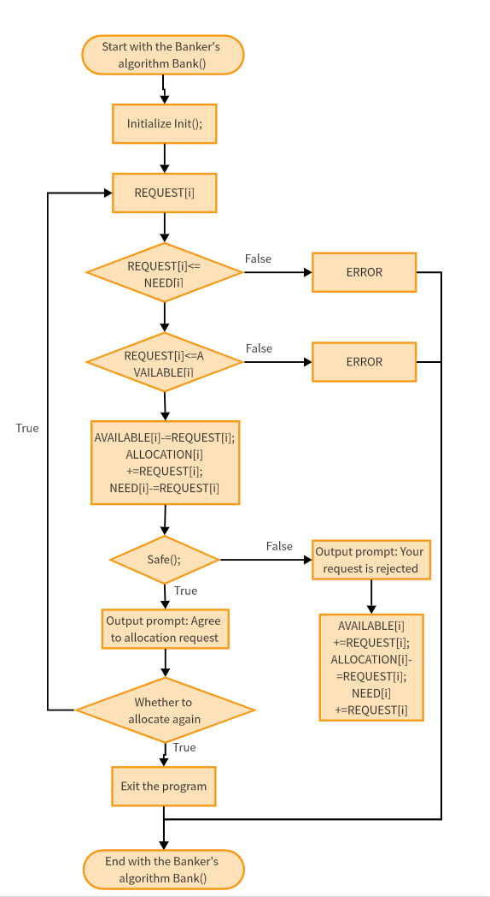

# Algorithm Problems Repository



A curated collection of common algorithms implemented in **C++**.  
This repository serves as a learning resource for sorting, searching, graph traversal, and dynamic programming problems.

---

## 📌 Why These Algorithms Matter

Understanding and implementing these algorithms helps you:

- Build a strong foundation in **algorithmic thinking** and problem-solving.
- Improve **runtime efficiency** and **memory usage** in programs.
- Prepare effectively for **technical interviews** and coding competitions.
- Gain practical knowledge for **real-world problem solving**.

---

## 📚 Algorithm Portfolio with Real-World Examples

| Algorithm                             | Why It’s Important                                                             | Real-Life Example                                                  |
| ------------------------------------- | ------------------------------------------------------------------------------ | ------------------------------------------------------------------ |
| **Bubble Sort**                       | Simple to understand; great for learning basic sorting logic.                  | Sorting a small classroom list by grade.                           |
| **Insertion Sort**                    | Efficient for nearly sorted data; adaptive with minimal overhead.              | Tidying up a nearly sorted playlist or to-do list.                 |
| **Selection Sort**                    | Predictable performance; useful in low-memory environments.                    | Choosing the fastest HR candidate from a small pool.               |
| **Counting Sort**                     | Excellent for integers within a known range; linear time complexity.           | Tallying scores for students when the maximum score is clear.      |
| **Merge Sort**                        | Stable and efficient; excellent for large datasets with guaranteed O(n log n). | Sorting a large user database or file listings.                    |
| **Quick Sort**                        | Typically fast in practice; widely used in standard libraries.                 | Organizing search results or lists quickly.                        |
| **Knapsack (0/1 & Fractional)**       | Helps master dynamic programming and greedy strategies.                        | Planning cargo load or budget allocation in shipping/logistics.    |
| **Longest Common Subsequence (LCS)**  | Fundamental for sequence alignment tasks.                                      | Comparing DNA strands in bioinformatics or versioning systems.     |
| **Matrix Chain Multiplication (MCM)** | Optimizes computation order—crucial for efficiency.                            | Optimizing chained database query execution or graphics rendering. |
| **Graph Traversals (BFS & DFS)**      | Essential for structure exploration, pathfinding, and component analysis.      | Mapping social networks or traversing file systems.                |

---

## 📂 Repository Structure

/
├── BFS.cpp – Breadth First Search
├── DFS.cpp – Depth First Search
├── Bubble sort.cpp – Naive sorting technique
├── Insertion sort.cpp
├── Selection sort.cpp
├── Merge sort.cpp
├── Quick sort.cpp
├── Counting Sort.cpp
├── Knapsack01.cpp – 0/1 Knapsack problem
├── Fractional Knapsack.cpp
├── Lcs.cpp – Longest Common Subsequence
├── MCM.cpp – Matrix Chain Multiplication
└── README.md – This document

## ⚙️ How to Use This Repository

1. **Clone** the repository:

   ```bash
   git clone https://github.com/iamnus07/Algorithm-_Problems.git
   cd Algorithm-_Problems
   Compile and run any .cpp file. Example with Merge Sort:

   ```

2. bash
   Copy code
   g++ "Merge sort.cpp" -o merge_sort
   ./merge_sort
   Experiment by modifying inputs and testing different scenarios.

🎯 Project Goals

1. Strengthen algorithmic intuition through direct implementation.

2. Show the practical relevance of each algorithm.

3. Provide a hands-on resource for self-study and classroom use.

🤝 Contributions
You can create visual diagrams or slides to explain algorithms.
Contributions—whether improving code, adding new algorithms, or optimizing existing ones—are highly welcome.

✨ Happy coding and exploring efficient algorithms! 🚀
